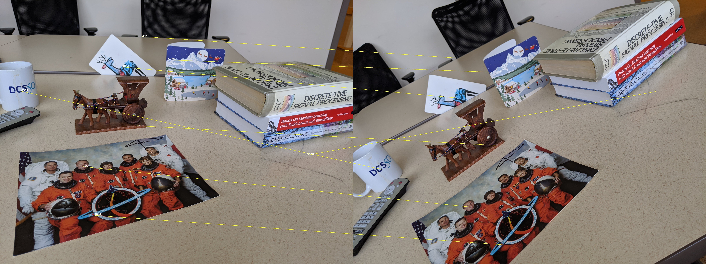

##CSC420 Assignment 4

#####Q1 Stereo Matching Costs

SSD Cost:
$$
SSD(\text{patch}_l, \text{patch}_r) = \sum_x\sum_y(I_{\text{patch}_l}(x,y)-I_{\text{patch}_l}(x,y))^2
$$
Normalized Correlation:
$$
NC(\text{patch}_l, \text{patch}_r) = \frac{\sum_x\sum_y(I_{\text{patch}_l}(x,y) \cdot I_{\text{patch}_l}(x,y))}{||I_{\text{patch}_l}|| \cdot ||I_{\text{patch}_r}||}
$$
Normalized Correlation might have a better performance. For two images captured by same camera with different exposure time, the picture with larger exposure time will be brighter with the same view if the camera is still. SSD only compute the difference between intensity, therefore same view with different intensity will still cause a large SSD cost. Then we will miss some matching bacause of the difference in intensity. But NC will normalized the difference, and reduce the difference between them.

#####Q2 Stereo Matching Implementation

###### code for a) and d) in file a4q2.py and appendix A. and the end of this report.

a)

With patch size 19. To reduce computation complexity, I only compare max to 70 patches that is to the left of $x_l$ in the right image on the scanline (since there will not have any possible matches to the right of $x_l$ ). Since the camera did not move really far away, the object will not have a huge movement inside the image as well. Therefore, we do not need to compare all patches on the scanline to find the correct match. The correct match will be in a smaller range that is around $x_l$ in the right image if it exists. If the camera moved more distance, could increase max_distance variable inside the function to compare more patches.

I choose ssd as matching cost and find the minimum ssd value of all patches.

Algorithm: For each pixel ($x_l$, $y_l$) in the bounding box in the left image. Find a patch with patch size 19 that centered at this patch. Then find the scan line $y = y_l$ in the right image. Loop over 70 patches from range $x_l - 70$ to $x_l$. For each pixel on scanline in the range, find a patch with patch size 19 centered at this pixel and compute the loss. Then compare this loss with the minimum loss we currently have, if this patch has a smaller loss, store the pixel index since it is the currently best match to the pixel in the left image. Then after loop over all 70 patches in the scanline, we have the best match right index $x_r$. Then depth could be computed as:
$$
Z = \frac{f \times b}{x_l - x_r},
$$
where f is camera focal lenght, b is baseline, $x_l - x_r$ is disparity. To avoid zero disparity a small number will be added onto the disparity to avoid zero division.

From the image below, we could see that most pixels are blue but there are some outliers on the top of tha car and on the side of the car there is a bright blue dot. Mostly, ouliers have really large value since $x_l - x_r$ is a really small value near 0. This might because it did not find any good match for the patch centered at such pixel. And also from the images the ground and the tree and also the wall will also be assigned similar depth as the car, which should be incorrect.


b)

With model from: https://github.com/feihuzhang/GANet and pre-trained weight they provided.

From the result image below, machine learning model definitely have a better result than the result from A. Firstly, there are no outliers or any bad values with really wrong disparity. And we could see the contour of the object such as car, wall and tree on the right side clearly. And they all have the reasonable computed disparity and the disparity changes more smoothly from smaller value to larger value (since the image shows the disparity, the pixels near camera have a larger value and it is bright than the objects that is far away from the camera). But the sky and the tree that are really far from the camera all become black which indicate a huge depth. 

The machine learning model also predict depth faster than the algorithm in a, since it predict the full image with similar time as the algorithm predict only a small part of the image in a). Since I use for loop in a) for comparsion and matching, even if I only compare max to 70 patches for each pixel, it still takes some time to complete the computation.


c)

The left and right images will be passed into a pipline for feature extracting which include several layers and "stacked hourglass CNN" is used. After that, the 4D cost volume will be formed based on the features of left and right images and the cost volume will be passed into a block for cost aggregation for "regularization", "refinement" and also "disparity regression".  Inside the cost aggration block, there are three Semi-Global Guided Aggregation(SGA) layers that will aggregates the matching cost in different directions and one Local Guided Aggregation(LGA) layers to refine the matching cost.

d)

The classification threshold: 1.3.

Since the center of the bounding box is the back of the car, use distance to this point to determine which part belongs to the car might miss the front of the car with a smaller threshold and will include too much space at the back of the car with a largerer threshold.


White inside segmentation indicates the car.

Segmentation for the full image:


#####Q3 Fundamental Matrix

######code in file a4q3.py and appendix B. and the end of this report.

With I1, I2, I3:

​                   


a)

For (I1, I2) pair: 

Show all matches with SIFT matching:


Eight picked matching that used for further computation:



For (I1, I3) pair: 

Show all matches with SIFT matching:


Eight picked matching that used for further computation:


b)

Computed $F_{12}$ with standard-8-point algorithm:

```
F_12 = [[ 8.06366442e-02 -1.56288447e-01 -6.16061783e+02]
 			  [ 1.31124208e-01  7.64600149e-02 -2.33933176e+02]
 				[ 2.94007503e+02  3.97276943e+02  1.00000000e+00]]
```

Computed $F_{13}$ with standard-8-point algorithm:

```
F_13 = [[-4.54748410e-03  1.91896402e-01  3.81383352e+01]
 				[-1.22782417e-02  4.93170743e-02 -1.44735220e+03]
 				[-2.32429570e+01  9.21869604e+02  1.00000000e+00]]
```

c)

Right epipolar lines for image pair (I1, I2):


From the image, we can  see that right epipolar lines all pass through the matches in the right image. And these lines will intersect at a point on the top of the image and will be outside of this image, which will be the estimated epipole with computed fundamental matrix $F_{12}$.

Right epipolar lines for image pair (I1, I3):


From the image, we can  see that right epipolar lines all pass through the matches in the right image. And these lines will intersect at a point on the right side of the image, which will be the estimated epipole with computed fundamental matrix $F_{13}$.

d)

Rectified image with homography computed by function:

```
 cv.warpPerspective(...)
```

for image pair (I1, I2) is:


Rectified image with homography computed with same opencv function for image pair (I1, I3) is:


For both image pairs, the left epipolar lines and right epipolar lines become parallel and at the similar level after rectify.

e)

Compute fundamental matrix $F'_{12}$ for image pair (I1,I2) with opencv function:

```
cv.findFundamentalMat(...)
```

```
F_12_cv = [[-7.16546498e-07  1.38761370e-06  6.92609744e-03]
 					 [-1.13539979e-06 -6.71752701e-07  1.70961423e-03]
 					 [-4.03638468e-03 -3.96127503e-03  1.00000000e+00]]
```

Image for right epipolar lines with computed $F'_{12}$:


Where yellow lines are with self computed $F_{12}$ and colored lines are computed with $F'_{12}$. Since they are use the same function to compute the epipolar line. Therefore, $F_{12}$ and $F'_{12}$ are similar. But they have different values inside the matrix. And since the lines did not overlap prefectly, they still have some difference value in the matrix. And $F'_{12}$ has norm 1, but $F_{12}$ does not. So $F'_{12}$ is similar to $F_{12}$ but normalized.

Compute fundamental matrix $F'_{13}$ for image pair (I1,I3) with same opencv function.

```
F_13_cv = [[ 5.57376706e-07 -1.93216860e-05 -4.90510727e-03]
 					 [ 3.54103383e-07 -4.41415098e-06  1.53709392e-01]
 	  			 [ 2.91396008e-03 -9.96780490e-02  1.00000000e+00]]
```

Image for right epipolar lines with computed $F'_{13}$:


Where yellow lines are with self computed $F_{13}$ and colored lines are computed with $F'_{13}$. From the image, $F_{13}$ and $F'_{13}$ are more similar than $F_{12}$ and $F'_{12}$ since the lines overlap better than the image for (I1, I2). And still $F'_{13}$ has norm 1, but $F_{13}$ does not. So $F'_{13}$ is similar to $F_{13}$ but normalized.

f)

For image pair (I1, I2) with $F'_{12}$ is:


For image pair (I1, I3) with $F'_{13}$ is:


For both image pairs, the left epipolar lines and right epipolar lines become parallel and at the similar level after rectify. And these images look similar to the result in d) since the fundamental matrixs are similar. But for rectified image pair (I1, I2) with $F'_{12}$, epipolar lines do not lie in the same level as with $F_{12}$.

<div style="page-break-after: always; break-after: page;"></div>
## Appendix A

Code for question 2.

```python
import numpy as np
import scipy.linalg as sp
import cv2 as cv


def two_norm(x):
    return np.sqrt(x.dot(x))


# Compute normalized correlation as matching loss and find the match with the max nc value
def nc_matching_loss(left_p, right_p):
    return np.dot(left_p, right_p) / (two_norm(left_p) * two_norm(right_p))


def ssd_matching_loss(left_p, right_p):
    return np.sum((left_p - right_p) ** 2)


# Q2 a)
# Compute depth of given image
# Z = f * T / (x_l - x_r)
def compute_depth(left_img, right_img, pt1, pt2, focal_len, baseline):
    w = pt2[0] - pt1[0] # x-direction
    h = pt2[1] - pt1[1] # y-direction
    depth_matrix = np.zeros((h, w))
    patch_size = 19
    k = patch_size // 2
    step = 1 # for sample
    print(h, w)

    max_distance = 70

    for r in range(h):
        for c in range(w):
            left_x = pt1[0] + c
            left_y = pt1[1] + r
            # For each (pixels), get a small patch
            left_p = left_img[left_y - k: left_y + k + 1, left_x - k: left_x + k + 1].astype(np.float)
            # scan the line and compare matches
            max_col = min(left_x + 1, right_img.shape[1] - k - 1)
            right_x = list(range(max_col - max_distance, max_col, step))
            # print(np.array(right_x).shape)
            right_p = np.array([right_img[left_y - k: left_y + k + 1, x - k: x + k + 1] for x in right_x]).astype(np.float)
            loss_matrix = np.array([ssd_matching_loss(left_p.flatten(), right_p[p].flatten()) for p in range(len(right_p))])
            # find most similar one
            best_matching = np.argmin(loss_matrix)

            # Compute Z by f * Z / (x_l - x_r)
            depth_matrix[r, c] = float(left_x - right_x[best_matching])

    print depth_matrix.max()
    print depth_matrix.min()
    # depth_matrix /= max_distance
    depth_matrix = np.full(depth_matrix.shape, focal_len * baseline) / (depth_matrix + 1.)
    depth_matrix /= depth_matrix.max()
    depth_matrix = depth_matrix * 255
    depth_matrix = depth_matrix.astype(np.uint8)
    depth_matrix = cv.applyColorMap(cv.GaussianBlur(depth_matrix, (3, 3), 0), cv.COLORMAP_JET)
    return depth_matrix


# predict car segmentation for the full image
def predict_car_full(depth, pt1, pt2, f, baseline, px, py):
    w = pt2[0] - pt1[0] # x-direction
    h = pt2[1] - pt1[1] # y-direction
    seg_map = np.zeros((depth.shape[0], depth.shape[1]))
    print(h, w)
    center_x = pt1[0] + w // 2
    center_y = pt1[1] + h // 2
    center_Z =(f * baseline) / (depth[center_y, center_x] + 0.1)
    center_3d = compute_3d_position(center_x, center_y, px, py, center_Z, f)
    print('2d center point: ({}, {})'.format(center_x, center_y))
    print('3d center point: {}'.format(center_3d))
    t = 1.3
    print('t: {}'.format(t))
    min_X = np.inf
    min_Y = np.inf
    min_Z = np.inf
    max_X = 0
    max_Y = 0
    max_Z = 0

    for r in range(depth.shape[0]):
        for c in range(depth.shape[1]):
            x = c
            y = r
            d = (f * baseline) / (depth[y, x] + 0.1)
            pos_3d = compute_3d_position(x, y, px, py, d, f)
            if compute_distance(pos_3d, center_3d) < t:
                # this point is in car
                seg_map[r, c] = 1
                if pos_3d[0] < min_X: min_X = pos_3d[0]
                if pos_3d[1] < min_Y: min_Y = pos_3d[1]
                if pos_3d[2] < min_Z: min_Z = pos_3d[2]
                if pos_3d[0] > max_X: max_X = pos_3d[0]
                if pos_3d[1] > max_Y: max_Y = pos_3d[1]
                if pos_3d[2] > max_Z: max_Z = pos_3d[2]

    return seg_map, (min_X, min_Y, min_Z), (max_X, max_Y, max_Z)


def compute_3d_position(x, y, px, py, Z, f):
    X = float(Z * (x - px)) / f
    Y = float(Z * (y - py)) / f
    return np.array([X, Y, Z])


def compute_2d_position(X, Y, Z, px, py, f):
    x = int((f * X) / Z + px)
    y = int((f * Y) / Z + py)
    return (x, y)


def compute_distance(pt1, pt2):
    return np.sqrt(np.sum((pt1 - pt2) ** 2))


if __name__ == '__main__':

    # Q2 a)
    left = cv.imread('../A4_files/000020_left.jpg')
    right = cv.imread('../A4_files/000020_right.jpg')

    # read bounding box info
    f_box = open("../A4_files/000020.txt", "r")
    fl_box = f_box.readlines()
    _, x1, y1, x2, y2 = fl_box[0].split()
    print(x1, y1, x2, y2)
    pt1 = (int(float(x1)), int(float(y1)))
    pt2 = (int(float(x2)), int(float(y2)))

    # read camera calibration info
    f = 0
    px = 0
    py = 0
    baseline = 0
    f_cal = open("../A4_files/000020_allcalib.txt", "r")
    fl_cal = f_cal.readlines()
    for l in fl_cal:
        print(l.split())
        label, n = l.split()
        if label == "f:":
            f = float(n)
        elif label == "px:":
            px = float(n)
        elif label == "py:":
            py = float(n)
        elif label == "baseline:":
            baseline = float(n)

    print(f, px, py, baseline)

    # Draw bounding box onto image
    left_box = left.copy()
    cv.rectangle(left_box, pt1, pt2, (255, 0, 255), 2)
    cv.imwrite("../results/left_box.jpg", left_box)
    box_img = left.copy()
    box_img = left[pt1[1]: pt2[1], pt1[0]: pt2[0]]
    cv.imwrite("../results/left_box_img.jpg", box_img)

    depth_box = compute_depth(left, right, pt1, pt2, f, baseline)
    depth_img = np.empty((box_img.shape[0], box_img.shape[1] + depth_box.shape[1], 3), dtype=np.uint8)
    depth_img[0: box_img.shape[0], 0: box_img.shape[1]] = box_img
    depth_img[0: box_img.shape[0], box_img.shape[1]: box_img.shape[1] + depth_box.shape[1]] = depth_box
    cv.imwrite("../results/q2a_depth_compare.jpg", depth_img)


    # Q2 d)
    print('##########################################')
    depth = cv.imread('../results/000020_GANet.jpg', 0)
    print depth.max()
    print depth
    depth_c = depth.copy()
    depth_c = cv.normalize(depth_c.astype(float), depth_c, 0, 1., cv.NORM_MINMAX)
    depth_c = depth_c ** (1. / 0.5)
    depth_c = cv.normalize(depth_c, depth_c, 0, 255., cv.NORM_MINMAX).astype(np.uint8)
    cv.imwrite("../results/q2d_depth_copy.jpg", depth_c)

    seg, min_pt, max_pt = predict_car_full(depth, pt1, pt2, f, baseline, px, py)
    car_seg_predict_full = np.zeros((seg.shape[0], seg.shape[1], 3))
    car_seg_predict_full[:, :, 0] = seg * 255
    car_seg_predict_full[:, :, 1] = seg * 255
    car_seg_predict_full[:, :, 2] = seg * 255
    cv.imwrite("../results/q2d_car_predict_segmentation_full.jpg", car_seg_predict_full)

    bounding_box_3d = left.copy()

    x1 = compute_2d_position(min_pt[0], min_pt[1], min_pt[2], px, py, f)
    x2 = compute_2d_position(max_pt[0], min_pt[1], min_pt[2], px, py, f)
    x3 = compute_2d_position(max_pt[0], max_pt[1], min_pt[2], px, py, f)
    x4 = compute_2d_position(min_pt[0], max_pt[1], min_pt[2], px, py, f)
    x5 = compute_2d_position(min_pt[0], min_pt[1], max_pt[2], px, py, f)
    x6 = compute_2d_position(max_pt[0], min_pt[1], max_pt[2], px, py, f)
    x7 = compute_2d_position(max_pt[0], max_pt[1], max_pt[2], px, py, f)
    x8 = compute_2d_position(min_pt[0], max_pt[1], max_pt[2], px, py, f)
    print('x1: ({}, {})'.format(x1[0], x1[1]))
    print('x4: ({}, {})'.format(x4[0], x4[1]))
    print('x7: ({}, {})'.format(x7[0], x7[1]))
    color = (255, 255, 0)
    cv.line(bounding_box_3d, x1, x2, color, 2)
    cv.line(bounding_box_3d, x2, x3, color, 2)
    cv.line(bounding_box_3d, x1, x4, color, 2)
    cv.line(bounding_box_3d, x3, x4, color, 2)
    cv.line(bounding_box_3d, x1, x5, color, 2)
    cv.line(bounding_box_3d, x2, x6, color, 2)
    cv.line(bounding_box_3d, x4, x8, color, 2)
    cv.line(bounding_box_3d, x5, x6, color, 2)
    cv.line(bounding_box_3d, x5, x8, color, 2)

    font = cv.FONT_HERSHEY_SIMPLEX
    cv.putText(bounding_box_3d, str(1), x1, font, .5, (0, 0, 255), 2, cv.LINE_AA)
    cv.putText(bounding_box_3d, str(2), x2, font, .5, (0, 0, 255), 2, cv.LINE_AA)
    cv.putText(bounding_box_3d, str(3), x3, font, .5, (0, 0, 255), 2, cv.LINE_AA)
    cv.putText(bounding_box_3d, str(4), x4, font, .5, (0, 0, 255), 2, cv.LINE_AA)
    cv.putText(bounding_box_3d, str(5), x5, font, .5, (0, 0, 255), 2, cv.LINE_AA)
    cv.putText(bounding_box_3d, str(6), x6, font, .5, (0, 0, 255), 2, cv.LINE_AA)
    # cv.putText(bounding_box_3d, str(7), x7, font, .5, (0, 0, 255), 2, cv.LINE_AA)
    cv.putText(bounding_box_3d, str(8), x8, font, .5, (0, 0, 255), 2, cv.LINE_AA)
    cv.imwrite("../results/q2d_car_predict_3d_bounding_box.jpg", bounding_box_3d)


```

<div style="page-break-after: always; break-after: page;"></div>
## Appendix B

Code for question 3.

```python
import numpy as np
import random
import cv2 as cv
import math


# a)
# find all matches with given images
def find_matches(query, img, ratio):
    sift = cv.xfeatures2d.SIFT_create()

    # find SIFT keypoints and descriptors
    keypoints_1, descriptors_1 = sift.detectAndCompute(query, None)
    keypoints_2, descriptors_2 = sift.detectAndCompute(img, None)

    # matching with knn matching
    FLANN_INDEX_KDTREE = 0
    index_params = dict(algorithm=FLANN_INDEX_KDTREE, trees=5)
    search_params = dict(checks=50)

    flann = cv.FlannBasedMatcher(index_params, search_params)
    matches = flann.knnMatch(descriptors_1, descriptors_2, k=2)

    # Filter matches with ratio, store good matches
    good_matches = []
    for m, n in matches:
        if m.distance < ratio * n.distance:
            good_matches.append(m)

    return keypoints_1, keypoints_2, good_matches


# view all matches with a given threshold
def view_matches(img_1, img_2):
    threshold = 0.56
    kp_1, kp_2, good_matches = find_matches(img_1, img_2, threshold)

    # Draw matches
    matched_img = np.empty((max(img_1.shape[0], img_2.shape[0]), img_1.shape[1] +       				img_2.shape[1], 3), dtype=np.uint8)
    cv.drawMatches(img_1, kp_1, img_2, kp_2, good_matches, matched_img,
                   flags=cv.DrawMatchesFlags_NOT_DRAW_SINGLE_POINTS)
    return kp_1, kp_2, good_matches, matched_img


def view_random_matches(kp_1, kp_2, matches, img_1, img_2):
    matched_img = np.empty((max(img_1.shape[0], img_2.shape[0]), img_1.shape[1] + img_2.shape[1], 3), dtype=np.uint8)
    matched_img[0: img_1.shape[0], 0: img_1.shape[1]] = img_1
    matched_img[0: img_2.shape[0], img_1.shape[1]: img_1.shape[1] + img_2.shape[1]] = img_2

    pts_1 = np.array([np.round(kp_1[m.queryIdx].pt) for m in matches])
    pts_2 = np.array([np.round(kp_2[m.trainIdx].pt) for m in matches])

    # randomly choose 8 random int
    eight_matches = [random.randint(0, len(matches) - 1) for _ in range(8)]
    print(eight_matches)
    for i in eight_matches:
        end1 = (int(pts_1[i, 0]), int(pts_1[i, 1]))
        end2 = (int(pts_2[i, 0]) + img_1.shape[1], int(pts_2[i, 1]))
        cv.line(matched_img, end1, end2, (0, 255, 255), 2)
        font = cv.FONT_HERSHEY_SIMPLEX
        cv.putText(matched_img, str(i), end1, font, .5, (255, 255, 255), 2, cv.LINE_AA)
    return eight_matches, matched_img


def view_reliable_matches(kp_1, kp_2, matches, indexs, img_1, img_2):
    matched_img = np.empty((max(img_1.shape[0], img_2.shape[0]), img_1.shape[1] + img_2.shape[1], 3), dtype=np.uint8)
    matched_img[0: img_1.shape[0], 0: img_1.shape[1]] = img_1
    matched_img[0: img_2.shape[0], img_1.shape[1]: img_1.shape[1] + img_2.shape[1]] = img_2

    pts_1 = np.array([np.round(kp_1[m.queryIdx].pt) for m in matches])
    pts_2 = np.array([np.round(kp_2[m.trainIdx].pt) for m in matches])

    # print(indexs)
    reliable_pts1 = []
    reliable_pts2 = []
    for i in indexs:
        end1 = (int(pts_1[i, 0]), int(pts_1[i, 1]))
        end2 = (int(pts_2[i, 0]) + img_1.shape[1], int(pts_2[i, 1]))
        reliable_pts1.append([int(pts_1[i, 0]), int(pts_1[i, 1])])
        reliable_pts2.append([int(pts_2[i, 0]), int(pts_2[i, 1])])
        cv.line(matched_img, end1, end2, (0, 255, 255), 2)
        font = cv.FONT_HERSHEY_SIMPLEX
        cv.putText(matched_img, str(i), end1, font, 1., (255, 255, 255), 2, cv.LINE_AA)
    return reliable_pts1, reliable_pts2, matched_img


# b)
def std_8_points_algo(kp1, kp2):
    # p_r.T * F * p_l = 0
    # construct matrix A
    print("*****std 8 points algo*****")
    A = np.zeros((len(kp1), 9))
    print(A.shape)
    for i in range(len(kp1)):
        x_l, y_l = kp1[i]
        x_r, y_r = kp2[i]
        A[i, :] = np.array([x_r * x_l, x_r * y_l, x_r, y_r * x_l, y_r * y_l, y_r, x_l, y_l, 1])

    # compute svd of A
    u_a, s_a, v_a = np.linalg.svd(A)

    # find f as the column corresponding to the smallest value in D
    index = np.argmin(s_a)
    # print(index)
    f = v_a[index]

    # reshape f to 3x3
    F = f.reshape((3, 3))

    # compute svd of F
    u_f, s_f, v_f = np.linalg.svd(F)
    # set smallest value in v to 0
    s_f[-1] = 0
    # compute F again
    F_rank_2 = np.matmul(u_f, np.matmul(np.diag(s_f), v_f))
    # make last element to 1.
    F_rank_2 /= F_rank_2[2, 2]
    return F_rank_2


# c)
def draw_epipolar_line(F, pt_other, pt_in, right_img):
    for i in range(len(pt_other)):
        x_l, y_l = pt_other[i]
        x_r, y_r = pt_in[i]
        left_pt = np.array([x_l, y_l, 1.]).astype(np.float)
        line_r = np.dot(F, left_pt)
        cv.circle(right_img, (x_r, y_r), 10, (255, 0, 255), -1)
        # find 2 points one line out of image
        x1 = 0
        y1 = (- line_r[2]) / (line_r[1])
        x2 = float(right_img.shape[1])
        y2 = (-1 * x2 * line_r[0] - line_r[2]) / (line_r[1])
        cv.line(right_img, (int(x1), int(y1)), (int(x2), int(y2)), (0, 255, 255), 2)
    return right_img


# d)
def rectify_img(img_1, img_2, pts1, pts2, F):
    h, w = img_1.shape[0:2]
    _, h_1, h_2 = cv.stereoRectifyUncalibrated(pts1, pts2, F, (w, h))

    print('***********rectify*****************')
    print(h_1)
    print(h_2)

    corners = np.asarray([[0, 0], [w, 0], [w, h], [0, h]], dtype=np.float32)
    corners = np.array([corners])

    dst_corners = cv.perspectiveTransform(corners, h_1)[0]
    dst_corners = np.asarray(dst_corners, dtype=np.float32)

    bbox = cv.boundingRect(dst_corners)
    w_after_l = bbox[2]
    h_after_l = bbox[3]

    # T2 is used to move left-top corner of bbox to (0,0)
    t_l = np.matrix([[1., 0., -1. * bbox[0]], [0., 1., -1. * bbox[1]], [0., 0., 1.]])

    dst_corners = cv.perspectiveTransform(corners, h_2)[0]
    dst_corners = np.asarray(dst_corners, dtype=np.float32)
    bbox_r = cv.boundingRect(dst_corners)

    w_after_r = bbox_r[2]
    h_after_r = bbox_r[3]

    t_r = np.matrix([[1., 0., -1. * bbox_r[0]], [0., 1., -1. * bbox_r[1]], [0., 0., 1.]])

    left_rect = cv.warpPerspective(img_1, t_l * h_1, (w_after_l, h_after_l))
    right_rect = cv.warpPerspective(img_2, t_r * h_2, (w_after_r, h_after_r))
    return left_rect, right_rect
  

def drawlines(right_img, lines, pts2):
    _, c, _ = right_img.shape
    for r, pt2 in zip(lines, pts2):
        color = tuple(np.random.randint(0, 255, 3).tolist())
        x0, y0 = map(int, [0, -r[2] / r[1]])
        x1, y1 = map(int, [c, -(r[2] + r[0] * c) / r[1]])
        cv.line(right_img, (x0, y0), (x1, y1), color, 2)
        cv.circle(right_img, tuple(pt2), 8, color, -1)
    return right_img


if __name__ == '__main__':
    l_1 = cv.imread('../prof/I1.jpg')
    l_2 = cv.imread('../prof/I2.jpg')
    l_3 = cv.imread('../prof/I3.jpg')

    # q3 a) show all matches
    kp_1_12, kp_2_12, good_matches_12, match_img_12 = view_matches(l_1, l_2)
    kp_1_13, kp_2_13, good_matches_13, match_img_13 = view_matches(l_1, l_3)
    print(len(good_matches_12))
    print(len(good_matches_13))
    cv.imwrite("../results/q3a_all_matches_12.jpg", match_img_12)
    cv.imwrite("../results/q3a_all_matches_13.jpg", match_img_13)

		# show 8 random matches
    eight_matches_12, eight_matched_img_12 = view_random_matches(kp_1_12, kp_2_12, good_matches_12, l_1, l_2)
    eight_matches_13, eight_matched_img_13 = view_random_matches(kp_1_13, kp_2_13, good_matches_13, l_1, l_3)
    cv.imwrite("../results/q3a_random_matches_12.jpg", eight_matched_img_12)
    cv.imwrite("../results/q3a_random_matches_13.jpg", eight_matched_img_13)

    # for prof's images
    # list of index into eight_matches_12 or eight_matches_13
    reliable_match_12 = [6514, 1077, 3608, 6444, 4054, 5749, 1911, 2811]
    reliable_match_13 = [133, 239, 398, 532, 466, 315, 507, 380]

    # show 8 selected reliable matches
    reliable_pts1_12, reliable_pts2_12, reliable_matched_img_12 = \
        view_reliable_matches(kp_1_12, kp_2_12, good_matches_12, reliable_match_12, l_1, l_2)
    reliable_pts1_13, reliable_pts2_13, reliable_matched_img_13 = \
        view_reliable_matches(kp_1_13, kp_2_13, good_matches_13, reliable_match_13, l_1, l_3)

    cv.imwrite("../results/q3a_reliable_matches_12.jpg", reliable_matched_img_12)
    cv.imwrite("../results/q3a_reliable_matches_13.jpg", reliable_matched_img_13)

    # q3 b) compute fundamental matrix
    F_12 = std_8_points_algo(reliable_pts1_12, reliable_pts2_12)
    F_13 = std_8_points_algo(reliable_pts1_13, reliable_pts2_13)

    # q3 c) calculate the epipolar lines in the right image
    ################ for (l1, l2) pair ####################
    right_img = l_2.copy()
    r_epipolar_line_img = draw_epipolar_line(F_12, reliable_pts1_12, reliable_pts2_12, right_img)
    cv.imwrite("../results/q3c_epipolar_line_r_12.jpg", r_epipolar_line_img)

    left_img = l_1.copy()
    l_epipolar_line_img = draw_epipolar_line(F_12.T, reliable_pts2_12, reliable_pts1_12, left_img)
    both_epipolar_line = np.empty(
        (max(left_img.shape[0], right_img.shape[0]), left_img.shape[1] + right_img.shape[1], 3), dtype=np.uint8)
    both_epipolar_line[0: left_img.shape[0], 0: left_img.shape[1]] = l_epipolar_line_img
    both_epipolar_line[0: right_img.shape[0],
    left_img.shape[1]: left_img.shape[1] + right_img.shape[1]] = r_epipolar_line_img
    cv.imwrite("../results/q3c_epipolar_line_both_12.jpg", both_epipolar_line)

    ################ for (l1, l3) pair ####################
    right_img = l_3.copy()
    r_epipolar_line_img_13 = draw_epipolar_line(F_13, reliable_pts1_13, reliable_pts2_13, right_img)

    left_img = l_1.copy()
    l_epipolar_line_img_13 = draw_epipolar_line(F_13.T, reliable_pts2_13, reliable_pts1_13, left_img)
    both_epipolar_line_13 = np.empty(
        (max(left_img.shape[0], right_img.shape[0]), left_img.shape[1] + right_img.shape[1], 3), dtype=np.uint8)
    both_epipolar_line_13[0: left_img.shape[0], 0: left_img.shape[1]] = l_epipolar_line_img_13
    both_epipolar_line_13[0: right_img.shape[0],
    left_img.shape[1]: left_img.shape[1] + right_img.shape[1]] = r_epipolar_line_img_13
    cv.imwrite("../results/q3c_epipolar_line_both_13.jpg", both_epipolar_line_13)

    # q3 d) rectify image with computed fundamental matrix
    # ################ for (l1, l2) pair ####################
    left_rect, right_rect = rectify_img(l_epipolar_line_img.copy(), r_epipolar_line_img.copy(), np.array(reliable_pts1_12), np.array(reliable_pts2_12), F_12)

    rectified_imgs_12 = np.empty(
        (max(left_rect.shape[0], right_rect.shape[0]), left_rect.shape[1] + right_rect.shape[1], 3), dtype=np.uint8)
    rectified_imgs_12[0: left_rect.shape[0], 0: left_rect.shape[1]] = left_rect
    rectified_imgs_12[0: right_rect.shape[0], left_rect.shape[1]: left_rect.shape[1] + right_rect.shape[1]] = right_rect
    cv.imwrite("../results/q3d_rectified_12.jpg", rectified_imgs_12)

    # ################ for (l1, l3) pair ####################
    left_rect_13, right_rect_13 = rectify_img(l_epipolar_line_img_13.copy(), r_epipolar_line_img_13.copy(), np.array(reliable_pts1_13), np.array(reliable_pts2_13), F_13)

    rectified_imgs_13 = np.empty(
        (max(left_rect_13.shape[0], right_rect_13.shape[0]), left_rect_13.shape[1] + right_rect_13.shape[1], 3), dtype=np.uint8)
    rectified_imgs_13[0: left_rect_13.shape[0], 0: left_rect_13.shape[1]] = left_rect_13
    rectified_imgs_13[0: right_rect_13.shape[0], left_rect_13.shape[1]: left_rect_13.shape[1] + right_rect_13.shape[1]] = right_rect_13
    cv.imwrite("../results/q3d_rectified_13.jpg", rectified_imgs_13)

    # # q3 e) compute fundamental matrix with opencv functions
    F_12_cv = cv.findFundamentalMat(np.array(reliable_pts1_12), np.array(reliable_pts2_12), cv.FM_LMEDS)[0]
    F_13_cv = cv.findFundamentalMat(np.array(reliable_pts1_13), np.array(reliable_pts2_13), cv.FM_LMEDS)[0]
    print("**********12************")
    print(F_12)
    print(np.linalg.norm(F_12))
    print('=============================')
    print(F_12_cv)
    print(np.linalg.norm(F_12_cv))
    print("**********13************")
    print(F_13)
    print(np.linalg.norm(F_13))
    print('=============================')
    print(F_13_cv)
    print(np.linalg.norm(F_13_cv))

    # draw epipolar line with F computed by cv
    ################ for (l1, l2) pair ####################
    lines2 = cv.computeCorrespondEpilines(np.array(reliable_pts1_12).reshape(-1, 1, 2), 1, F_12_cv)
    lines2 = lines2.reshape(-1, 3)
    r_epipolar_line_img_cv_12 = drawlines(r_epipolar_line_img, lines2, np.array(reliable_pts2_12))
    cv.imwrite("../results/q3c_epipolar_line_r_cv_12.jpg", r_epipolar_line_img_cv_12)
    
    ################ for (l1, l3) pair ####################
    lines3 = cv.computeCorrespondEpilines(np.array(reliable_pts1_13).reshape(-1, 1, 2), 1, F_13_cv)
    lines3 = lines3.reshape(-1, 3)
    r_epipolar_line_img_cv_13 = drawlines(r_epipolar_line_img_13, lines3, np.array(reliable_pts2_13))
    cv.imwrite("../results/q3c_epipolar_line_r_cv_13.jpg", r_epipolar_line_img_cv_13)

    # q3 e) rectify image with computed fundamental matrix by opencv functions
    ################ for (l1, l2) pair ####################
    right_img = l_2.copy()
    lines2_cv = cv.computeCorrespondEpilines(np.array(reliable_pts1_12).reshape(-1, 1, 2), 1, F_12_cv)
    lines2_cv = lines2_cv.reshape(-1, 3)
    Qf_r_epipolar_line_img_cv_12 = drawlines(right_img, lines2_cv, np.array(reliable_pts2_12))

    left_img = l_1.copy()
    lines1_cv = cv.computeCorrespondEpilines(np.array(reliable_pts2_12).reshape(-1, 1, 2), 1, F_12_cv.T)
    lines1_cv = lines1_cv.reshape(-1, 3)
    Qf_l_epipolar_line_img_cv_12 = drawlines(left_img, lines1_cv, np.array(reliable_pts1_12))

    left_rect_cv_12, right_rect_cv_12 = rectify_img(Qf_l_epipolar_line_img_cv_12, Qf_r_epipolar_line_img_cv_12, np.array(reliable_pts1_12), np.array(reliable_pts2_12), F_12_cv)

    rectified_imgs_cv_12 = np.empty(
        (max(left_rect_cv_12.shape[0], right_rect_cv_12.shape[0]), left_rect_cv_12.shape[1] + right_rect_cv_12.shape[1], 3), dtype=np.uint8)
    rectified_imgs_cv_12[0: left_rect_cv_12.shape[0], 0: left_rect_cv_12.shape[1]] = left_rect_cv_12
    rectified_imgs_cv_12[0: right_rect_cv_12.shape[0],
    left_rect_cv_12.shape[1]: left_rect_cv_12.shape[1] + right_rect_cv_12.shape[1]] = right_rect_cv_12
    cv.imwrite("../results/q3f_rectified_cv_12.jpg", rectified_imgs_cv_12)

    # ################ for (l1, l3) pair ####################
    right_img = l_3.copy()
    lines2_cv = cv.computeCorrespondEpilines(np.array(reliable_pts1_13).reshape(-1, 1, 2), 1, F_13_cv)
    lines2_cv = lines2_cv.reshape(-1, 3)
    Qf_r_epipolar_line_img_cv_13 = drawlines(right_img, lines2_cv, np.array(reliable_pts2_13))

    left_img = l_1.copy()
    lines1_cv = cv.computeCorrespondEpilines(np.array(reliable_pts2_13).reshape(-1, 1, 2), 1, F_13_cv.T)
    lines1_cv = lines1_cv.reshape(-1, 3)
    Qf_l_epipolar_line_img_cv_13 = drawlines(left_img, lines1_cv, np.array(reliable_pts1_13))

    left_rect_cv_13, right_rect_cv_13 = rectify_img(Qf_l_epipolar_line_img_cv_13, Qf_r_epipolar_line_img_cv_13, np.array(reliable_pts1_13), np.array(reliable_pts2_13), F_13_cv)

    rectified_imgs_cv_13 = np.empty(
        (max(left_rect_cv_13.shape[0], right_rect_cv_13.shape[0]), left_rect_cv_13.shape[1] + right_rect_cv_13.shape[1], 3), dtype=np.uint8)
    rectified_imgs_cv_13[0: left_rect_cv_13.shape[0], 0: left_rect_cv_13.shape[1]] = left_rect_cv_13
    rectified_imgs_cv_13[0: right_rect_cv_13.shape[0],
    left_rect_cv_13.shape[1]: left_rect_cv_13.shape[1] + right_rect_cv_13.shape[1]] = right_rect_cv_13
    cv.imwrite("../results/q3f_rectified_cv_13.jpg", rectified_imgs_cv_13)
```